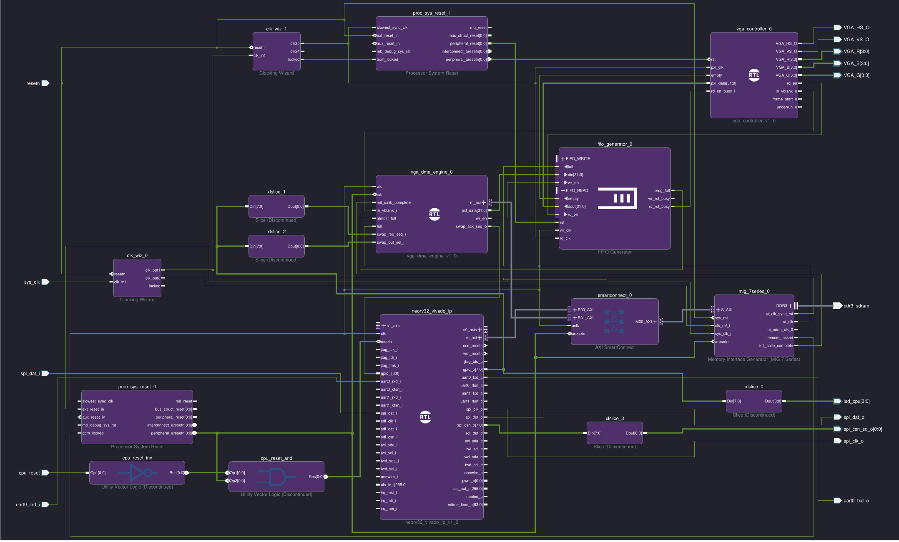

# DOOM on NEORV32

The [NEORV32](https://github.com/stnolting/neorv32) is a 32-bit RISC-V processor written in VHDL. This project synthesizes it onto a **Digilent Arty A7-100** FPGA board, wires it up to 256 MB of DDR3 RAM and a VGA display via PMOD connectors, loads `DOOM1.WAD` from an SD card at runtime, and boots the original DOOM engine.

| | |
|--------|-------|
| Platform | Digilent Arty A7-100T (Xilinx Artix-7) |
| CPU | NEORV32 RISC-V (`rv32imc_zicsr_zifencei_zba_zbb`) |
| Clock | 81 MHz |
| RAM | 256 MB DDR3 |
| Display | 640×480 @ 60 Hz VGA via PMOD |
| Frame rate | ~2.4 FPS |
| WAD source | SD card (runtime load) |
| WAD size | 4 MB (DOOM1 shareware) |

---

https://github.com/user-attachments/assets/40dc531c-aafd-474a-8ac5-4f7e98fc5742

---

## Architecture

```
                                                    ┌────────────────┐
                                                    │  DDR3 SDRAM    │
                                                    │  256 MB        │
                                                    └──┬─────────┬───┘
                                                  data │         │ data
┌──────────────────────────────────────────────────────┼─────────┼────┐
│  Arty A7-100 FPGA                                    │         │    │
│                                                ┌─────┴─────────┴──┐ │
│                                                │   MIG Controller │ │
│                                                │   @ 0x10000000   │ │
│                                                └────────┬─────────┘ │
│                                                         │ AXI       │
│  ┌─────────────┐    ┌──────────────┐                    │           │
│  │  NEORV32    │───▶│ SmartConnect │◀───────────────────┘           │
│  │  RISC-V     │    │    AXI       │                                │
│  │  81  MHz    │    │  Crossbar    │                                │
│  └─────────────┘    └──────────────┘                                │
│        │                   ▲                                        │
│   GPIO │              ┌────┴────┐                                   │
│ (swap  │              │ VGA DMA │                                   │
│  req/  ├─────────────▶│ Engine  │                                   │
│  ack)  │              └────┬────┘                                   │
│        │                   ▼ 81 MHz                                 │
│        │              ┌────┴────┐                                   │
│        │              │ Async   │                                   │
│        │              │ FIFO    │                                   │
│        │              └────┬────┘                                   │
│        │                   ▼ 25 MHz                                 │
│        │              ┌────┴──────────────┐                         │
│        │              │  VGA Controller   │                         │
│        │              │  640×480 @ 60 Hz  │                         │
│        │              │  RGB888 → RGB444  │                         │
│        │              └────────┬──────────┘                         │
│        │                       │ RGB444 + sync                      │
└────────┼───────────────────────┼────────────────────────────────────┘
         │                       ▼
   SD Card (SPI)        PMOD JC (R,B) + JD (G,HS,VS)
   on PMOD JB
```
---

### Block Design



### Frame Rendering Pipeline

1. DOOM renders directly into a DDR3 framebuffer (640×400, 32-bit RGB888)
2. VGA DMA engine reads the framebuffer over AXI in bursts
3. Async FIFO crosses from DDR3 clock domain to 25 MHz pixel clock domain
4. VGA controller converts RGB888 → RGB444, adds 40-line letterbox top and bottom
5. Double-buffer swap (via GPIO handshake) happens on the next vblank to avoid tearing

### Memory Map

| Address Range | Size | Purpose |
|---------------|------|---------|
| `0x10200000–0x102F9FFF` | 1 MB | Framebuffer 0 (640×400 × 4 bytes) |
| `0x10300000–0x103F9FFF` | 1 MB | Framebuffer 1 (640×400 × 4 bytes) |
| `0x11000000–0x12FFFFFF` | 32 MB | ROM — code + rodata |
| `0x13000000–0x1EFFFFFF` | 192 MB | RAM — data, heap, stack |
| `0x15000000` | 8 MB max | WAD file (loaded from SD card) |

---

## Hardware Requirements

| Component | Details |
|-----------|---------|
| FPGA board | Digilent Arty A7-100T |
| VGA adapter | PMOD VGA (JC: R+B, JD: G+sync) — standard 12-bit PMOD pinout |
| SD card | FAT/FAT32, `DOOM1.WAD` in root directory |
| SD card adapter | PMOD on JB (SPI mode) |
| USB-UART | On-board (FTDI) — `/dev/ttyUSB1` at 115200 baud |
| WAD file | `DOOM1.WAD` (shareware v1.9 is freely available) |

---

## Getting Started

### 1. Prerequisites

- **Vivado 2025.2** (for bitstream generation)
- **RISC-V toolchain**: `riscv-none-elf-gcc` (e.g., from [xPack](https://xpack.github.io/riscv-none-elf-gcc/))
- A FAT-formatted SD card with `DOOM1.WAD` copied to the root directory

### 2. Clone the repository

```bash
git clone --recurse-submodules https://github.com/YOUR_USERNAME/doom-on-neorv32.git
cd doom-on-neorv32
```

### 3. Generate the Vivado project

```bash
make project
```

Open `neodoom/neodoom.xpr` in Vivado, run synthesis + implementation, and program the board.

### 4. Build the DOOM firmware

```bash
make -C sw/doom clean_all exe
```

This produces `sw/doom/neorv32_exe.bin`.

### 5. Upload and run

Insert the SD card (with `DOOM1.WAD`) into the PMOD JB adapter, connect USB, then:

```bash
make -C sw/doom upload UART_TTY=/dev/ttyUSB1
```

Expected boot output on the serial terminal:

```
========================================
       DOOM on NEORV32 RISC-V
========================================
Clock:    83333333 Hz
MISA:     0x40801106

Loading DOOM1.WAD from SD card...
SPI init clock: 20345 Hz
SPI run clock:  20833333 Hz
Copying DOOM1.WAD
IWAD load done: 4196020 bytes, 8723 ms, 469 KiB/s
IWAD ready: DOOM1.WAD @0x15000000 (4196020 bytes)
Starting DOOM...

===========================================================================
                            DOOM Shareware
===========================================================================

```

---

## Project Structure

```
doom-on-neorv32/
├── constraints/
│   └── arty.xdc              # Pin assignments (VGA PMODs, SD SPI, UART)
├── modules/
│   └── neorv32/              # NEORV32 RISC-V core (git submodule)
├── rtl/
│   └── vga/
│       ├── vga_controller.vhd   # VGA timing + RGB888→RGB444 conversion
│       └── vga_dma.vhd          # AXI framebuffer DMA
├── scripts/
│   ├── create_project.tcl    # Vivado project generation
│   └── block_design.tcl      # IP integrator block design
├── sw/
│   ├── doom/                 # DOOM application
│   │   └── src/
│   │       ├── main.c                    # Entry point, WAD loading
│   │       ├── doomgeneric_neorv32.c     # Platform layer (video, timing, input)
│   │       ├── neorv32_vga.c/h           # VGA double-buffer API
│   │       ├── wad_sd_loader.c/h         # SD card WAD loading (Petit FatFs)
│   │       └── w_file_sdram.c            # SDRAM-backed WAD file I/O
│   ├── vga_testpattern/      # Standalone VGA test
│   ├── frame_write_bench/    # DDR3 write bandwidth benchmark
│   └── wad_sd_to_sdram/      # Standalone WAD loader (debug utility)
└── sim/                      # VHDL testbenches (GHDL + OSVVM)
```

---

## Build Reference

```bash
# Rebuild bootloader ROM (only needed if bootloader config changes)
make -C modules/neorv32/sw/bootloader clean bootloader

# Build any standalone app
make -C sw/<app> clean all

# Show memory layout (doom only)
make -C sw/doom info
make -C sw/doom check_layout

# Debug via JTAG/OpenOCD
openocd -f modules/neorv32/sw/openocd/neorv32.cfg
riscv-none-elf-gdb sw/doom/main.elf \
  -ex "target extended-remote localhost:3333" \
  -ex "load" -ex "continue"
```

---

## Credits

- **[NEORV32](https://github.com/stnolting/neorv32)** by Stephan Nolting. Amazingly well documented Core+Ecosystem
- **[doomgeneric](https://github.com/ozkl/doomgeneric)** A portable DOOM wrapper
- **DOOM** by id Software (1993)
- **[Petit FatFs](http://elm-chan.org/fsw/ff/00index_p.html)** Lightweight FAT filesystem for SD card access

---

## License

The DOOM engine source is subject to the [id Software DOOM Source License](https://github.com/id-Software/DOOM/blob/master/linuxdoom-1.10/README). All other project files in this repository are MIT licensed.
